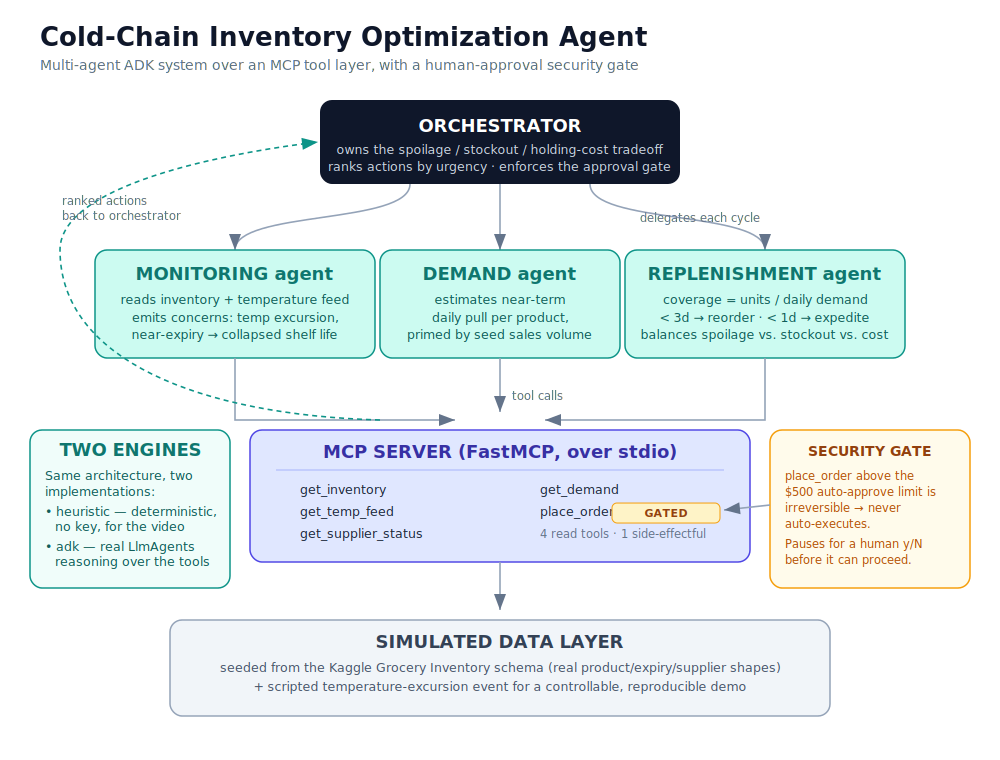

# Cold-Chain Inventory Optimization Agent

A multi-agent system that continuously monitors perishable inventory, reasons over
conflicting business goals — spoilage vs. stockout vs. holding cost — and produces a
ranked list of reorder actions. It executes the safe, cheap actions autonomously and
**pauses for human approval before anything irreversible or expensive.**

> Kaggle **"Agents for Business"** capstone. Built on a multi-agent ADK architecture
> with an MCP server as the data/tool layer and a cost-threshold security gate.

---

## The Problem

Cold-chain operators — grocery distributors, pharmacy depots, food producers — lose money
three ways at once, and the three losses pull against each other:

- **Spoilage.** Perishable stock expires. Over-ordering or holding too long destroys margin.
- **Stockouts.** Empty shelves lose sales and erode trust. Under-ordering is just as costly.
- **Operational waste.** Over-cooling, panic expedites, and emergency reorders burn cash that
  careful timing would have saved.

These are not three separate problems with three separate fixes. They are one continuous
balancing act over messy, fast-moving data: inventory counts, expiry windows, refrigeration
temperature feeds, shifting near-term demand, and unreliable supplier timelines — each arriving
from a different system, in a different shape, at a different cadence. Today this runs on
spreadsheets and operator intuition. Decisions lag the data, and the lag costs money.

## Why an Agent

A demand forecaster solves one slice. A reorder-point formula solves another. Neither *decides*.
The actual job is continuous synthesis of conflicting signals followed by judgment: what to do,
how urgently, and — critically — **when to act autonomously versus escalate to a human.**

That decision loop is exactly what an agent is for. It synthesizes heterogeneous, messy inputs
no single solver consumes; it reasons under conflicting objectives; it chooses actions and
sequences them by urgency and value; and it knows its own limits, pausing for human approval
before anything irreversible. The multi-agent decomposition here is genuine, not decorative:
monitoring, demand, and replenishment are distinct reasoning jobs with distinct inputs,
coordinated by an orchestrator that owns the tradeoff and the safety gate.

## Solution Overview

The agent turns a reactive, spreadsheet-driven process into a proactive one. Each cycle, the
orchestrator gathers fresh readings through the MCP tool layer, hands them to the three
specialist agents, and folds their outputs into a single ranked action list. Cheap, reversible
actions execute automatically; expensive irreversible ones stop at a human-approval gate.

The project ships two runnable cycles that together tell the whole story:

```bash
python -m demo.run --cycle normal      # calm steady-state: small reorders, nothing alarming
python -m demo.run --cycle excursion   # a fridge drifts out of range -> live re-rank -> approval gate
```

**Two engines, one architecture.** The same orchestrator/specialist/MCP design runs in either of
two modes. The default **heuristic engine** is deterministic Python — no API key, warm and
reproducible, which is what the recorded demo uses (the narrative calls for full control and zero
integration risk). The opt-in **ADK engine** (`--engine adk`) runs the specialists and orchestrator
as real ADK `LlmAgent`s that reason over the MCP tools through an `MCPToolset`. Both enforce the
same human-approval gate. This keeps the video bulletproof while making the multi-agent-ADK and
MCP-server concepts real end-to-end.

## Architecture



The orchestrator delegates each cycle to the three specialists, which read and act through the MCP
server over the simulated data layer; proposed orders pass back through the orchestrator's ranking
and the security gate before anything executes.

**Orchestrator** (`agents/orchestrator.py`) — the coordinator. It runs one full decision cycle:
collects specialist outputs, ranks the proposed actions by urgency (high → medium → low), and
enforces the human-approval gate on any action flagged `requires_approval`. Nothing irreversible
executes without passing through it.

**Monitoring agent** (`agents/specialists.py`) — reads inventory and the refrigeration temperature
feed and emits structured *concerns*. A cold batch that breaches its safe range has its effective
shelf life collapse to zero; a batch within four days of expiry is flagged as near-expiry.

**Demand agent** (`agents/specialists.py`) — estimates near-term daily pull per product, primed by
the seed dataset's sales volumes. This is the signal replenishment weighs stock coverage against.

**Replenishment agent** (`agents/specialists.py`) — the brain. It balances spoilage, stockout, and
holding cost into proposed orders using a deliberately legible coverage heuristic:
`coverage_days = available_units / daily_demand`, where excursion-hit batches contribute zero
units. Coverage under three days triggers a reorder; under one day, the gap is urgent and it
proposes an expedite — which may exceed the cost threshold and trip the security gate.

**MCP server** (`mcp_server/server.py`) — the tool layer every agent calls. Four read tools expose
inventory, the temperature feed, supplier status, and demand. The one side-effectful tool,
`place_order`, is the trust boundary: when an expedite's cost exceeds the auto-approve limit it
returns `requires_approval=True` and `irreversible=True`, and the orchestrator must not execute it
without a human yes.

**Simulated data layer** (`data/sim.py`) — seeded from the Kaggle Grocery Inventory schema, so
product names, expiry windows, reorder quantities, and supplier info look real. The temperature
feed and the on-cue excursion event are simulated for full control of the demo with zero
integration risk. Drop the full Kaggle CSV in `data/seed/` and it loads automatically.

**Data flow per cycle:** orchestrator → monitoring/demand/replenishment specialists → MCP read
tools → simulated feed, then proposed orders → MCP `place_order` → orchestrator ranking and the
approval gate → final ranked action list.

## Course Concepts Demonstrated

| Concept | Where it lives |
|---|---|
| **Multi-agent system (ADK)** | An orchestrator agent coordinating three specialist agents — monitoring, demand, and replenishment — each a distinct reasoning job with distinct inputs. Implemented as ADK `LlmAgent`s in `agents/adk_agents.py` (`--engine adk`), with a deterministic Python mirror in `agents/specialists.py` + `agents/orchestrator.py` for the recorded demo. |
| **MCP server** | A dedicated tool layer the agents call for all data and the one side-effectful action; read tools are unrestricted, `place_order` is gated. Served over stdio via FastMCP (`python -m mcp_server.server`) and consumed by the ADK agents through an `MCPToolset` (`mcp_server/server.py`). |
| **Security features** | A cost-threshold human-approval gate. Orders above `AUTO_APPROVE_LIMIT_USD` ($500) are marked irreversible and never auto-execute. Enforced deterministically in both engines — by the orchestrator loop in heuristic mode and by an ADK `before_tool_callback` that intercepts `place_order` in ADK mode (`mcp_server/server.py`, `agents/orchestrator.py`, `agents/adk_agents.py`). |
| **Deployability** | Each cycle is a single stateless run against the live feed — exactly one scheduled tick. Wire `python -m demo.run` to a scheduler (cron, a cloud job) and the agent runs autonomously, surfacing ranked actions and escalating only when the gate trips. |

## Setup

Requires **Python 3.10+**.

The **default demo runs on the standard library alone** — no install needed:

```bash
git clone https://github.com/liridonezhk/coldchain-agent.git
cd coldchain-agent
python -m demo.run --cycle normal
```

Install the dependencies only for the real agent layer (`--engine adk`) or to serve the MCP server
standalone:

```bash
python -m venv .venv
source .venv/bin/activate            # Windows: .venv\Scripts\activate
pip install -r requirements.txt      # mcp + google-adk + python-dotenv

cp .env.example .env                 # then put your key in .env (GOOGLE_API_KEY=...)
```

The project loads **only its own `.env`** (by explicit path), so it won't inherit a `.env` from a
parent folder or another project, and a project `.env` overrides any stale shell variable. `.env`
is gitignored. You can still `export GOOGLE_API_KEY=...` instead of using a file if you prefer.

To use Claude instead of Gemini for the ADK agents, swap the `MODEL` constant in
`agents/adk_agents.py` for the commented `LiteLlm(...)` line and set `ANTHROPIC_API_KEY` in `.env`.

### Data: sample vs. full dataset

The repo ships a small 6-row sample (`data/seed/grocery_inventory_sample.csv`) that the demo uses by
default — deterministic and clean, ideal for the recorded video. To run on the **real 990-row Kaggle
export**, drop it in as `data/seed/grocery_inventory_full.csv` and it's picked up automatically (the
full file wins over the sample). If neither is present, a baked-in fallback keeps the demo running.

The loader handles the real export's quirks so it's a true drop-in: it parses `$`-formatted prices,
filters to `Active` stock (≈332 of 990), infers refrigeration from the product **category** (the real
data stores street addresses, not cold zones), and anchors the simulation's "today" to the dataset's
2024 calendar so expiries land in a realistic spread instead of all reading as expired. On the full
data the excursion targets **Parmesan Cheese** (a dairy product spanning several cold batches); a
refrigeration failure collapses its cold stock and the ~$933 expedited replacement trips the approval
gate. The small sample keeps its fixed reference date, so its numbers never move.

## Running the Demo

### Beat 1 — Normal cycle

```bash
python -m demo.run --cycle normal
```

A routine cycle. The monitoring agent reads inventory, expiry windows, and the temperature feed;
the demand agent estimates near-term pull; the replenishment agent weighs the tradeoffs; the
orchestrator ranks. The result is calm — a small auto-executed reorder, nothing alarming:

```
  RANKED ACTIONS
  ------------------------------------------------------------
  [medium] Strawberries 250g AUTO_EXECUTED      $0     — coverage 2.0d (units 12 / demand 6/d)
```

### Beats 2 & 3 — Excursion and the approval gate

```bash
python -m demo.run --cycle excursion
```

A refrigeration unit drifts out of range on Batch B-001 (Whole Milk). The monitoring agent catches
the breach; risk reasoning concludes the batch's shelf life just collapsed; replenishment recomputes
and finds projected demand now exposed, so a replacement expedite becomes urgent. Because that
expedite costs $592 — above the $500 auto-approve limit — the orchestrator **stops and asks**:

```
>>> EVENT: temperature excursion on B-001 (Whole Milk 2L)

  ⛔ APPROVAL REQUIRED (irreversible, over auto-approve limit)
     Expedite 40 units of Whole Milk 2L — $592
     Approve? [y/N]
```

The gate is interactive: type `y` to approve (the action becomes `APPROVED_EXECUTED`) or anything
else to leave it `PENDING_APPROVAL`. The cheaper produce reorder auto-executes either way:

```
  RANKED ACTIONS
  ------------------------------------------------------------
  [  high] Whole Milk 2L PENDING_APPROVAL   $592   — coverage 0.0d (units 0 / demand 8/d)
  [medium] Strawberries 250g AUTO_EXECUTED      $0     — coverage 1.7d (units 12 / demand 7/d)
```

Autonomy where it's safe, a gate where it isn't. (Demand figures carry light randomness, so exact
numbers vary slightly between runs; the urgency ordering and the gate do not.)

### The ADK engine (real LLM agents)

The same two cycles run through genuine ADK agents with `--engine adk`:

```bash
pip install -r requirements.txt
export GOOGLE_API_KEY=...                       # Gemini key (or swap MODEL for Claude)
python -m demo.run --cycle excursion --engine adk
```

Here the orchestrator delegates to the monitoring, demand, and replenishment `LlmAgent`s, which
call the MCP tools over stdio. The approval gate is enforced by an ADK `before_tool_callback` that
intercepts `place_order` — so the same `$592 > $500` expedite still pauses for your `y/N` before it
can execute. Output is the agents' own narrated ranked list rather than the fixed table above, so
use the default heuristic engine for the recorded video and the ADK engine to demonstrate the live
multi-agent reasoning.

### Holiday-aware demand

Perishable demand spikes before big holidays, and unevenly by category — dairy, produce, meat, and
bakery move most. The demand agent lifts its estimate for the affected categories during the lead-up
to a holiday (New Year, Valentine's, Independence Day, Halloween, Thanksgiving, Christmas). Use
`--as-of` to set the simulation date and watch it change the agent's behaviour:

```bash
python -m demo.run --cycle normal --as-of 2026-06-28   # Independence Day lead-up
```

```
  🎉 Holiday demand uplift active: Independence Day — elevated pull on perishable categories …
  [  high] Strawberries 250g      PENDING_APPROVAL   $512   — coverage 0.0d (units 0 / demand 11/d)
  [  high] Spinach Bag 200g       AUTO_EXECUTED      $281   — coverage 0.0d (units 0 / demand 9/d)
```

The uplift is **dormant on ordinary days**, so the default sample and full-dataset runs (and the
recorded demo) are unchanged. It's a static, deterministic calendar today; the demand agent's
`get_demand` is also the natural place to wire a live external signal (a holidays API or web search)
if you want the agent to discover demand drivers instead of reading them from a table.

## Project Layout

```
coldchain/
├── README.md                 # this file
├── LICENSE                   # MIT (code); dataset stays CC BY 4.0
├── .env.example              # copy to .env for the ADK engine's API key
├── requirements.txt          # mcp + google-adk (only needed for the agent layer)
├── docs/
│   ├── WRITEUP.md            # project writeup (Agents for Business)
│   └── architecture.svg      # architecture diagram (also embedded above)
├── data/
│   ├── sim.py                # simulated data layer (Kaggle-schema seed + excursion injector)
│   └── seed/
│       ├── grocery_inventory_sample.csv   # small 6-row sample (default; used for the video)
│       └── grocery_inventory_full.csv     # optional real 990-row Kaggle export (wins if present)
├── mcp_server/
│   └── server.py             # MCP tool layer (FastMCP), incl. the gated place_order
├── agents/
│   ├── specialists.py        # heuristic monitoring / demand / replenishment (default engine)
│   ├── orchestrator.py       # heuristic ranking + human-approval gate (default engine)
│   └── adk_agents.py         # ADK LlmAgents over MCP + approval callback (--engine adk)
└── demo/
    ├── run.py                # demo runner (both cycles, both engines, --as-of)
    └── record.py             # one-command runner for recording the video
```

## Data Attribution

Seeded from the **Grocery Inventory and Sales Dataset** by Salahuddin Ahmed Shuvo, licensed
**CC BY 4.0**.
<https://www.kaggle.com/datasets/salahuddinahmedshuvo/grocery-inventory-and-sales-dataset>

Product names, expiry windows, reorder quantities, and supplier details derive from this dataset's
schema. The refrigeration temperature feed and the temperature-excursion event are simulated to give
the demo a controllable, reproducible reaction the agent responds to live.

## License

Project code is released under the **MIT License** (see [LICENSE](LICENSE)). The seed dataset
retains its original **CC BY 4.0** license as noted above.
